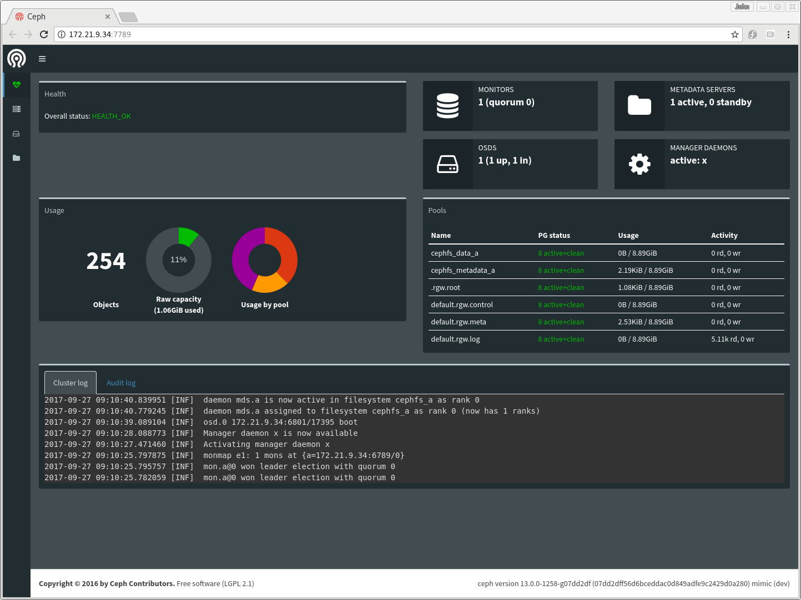

<h1>Ceph在各个场景下的行为分析</h1>
[TOC]
# dashboard

# 各种场景下ceph的行为

**某个osd down后短期内不会再上线((坏盘)**

**某个osd down后再心跳时间内重新上线((网络丢包)**
  

**某个osd down后被monitor置为down状态,osd上的pg重新选择新的osd时间段内重新上线(拔盘或者网络不通一段时间后重新插入盘和网络故障恢复**

		以三副本为例，pg 2.1b原来的分布是[3,1,0],手工将osd.3 down掉后,2.1b 的pg状态就变成了active+undersized+degraded,
	然后选择另一个osd 2,最终变成了[0,1,2],状态成为active+clean.原来的osd 0 变成了primary osd。当手工把osd.3重新拉起来，pg 2.1b的osd set又恢复成为了[3,0,1]
	问题：
	1.osd down后pg重新映射到一个新的osd上后,原来down的osd重新上线，为什么还会再映射回去？
	
	2.osd down后pg重新映射到新的osd的过程中，原来的osd重新上线，原来映射了到新osd的pg怎么处理？
	
	3.osd down后，pg变成active+undersized+degraded状态的过程中，如果down的是primary pg所在osd，IO读写能否继续？
如果能继续的话，一边在写，一边在重新映射新的osd进行backfill，写的IO路径是先写主，从要写一个还是重新映射的也要写然后再返回用户写成功?

## osd新加入集群(扩容插入新盘)

